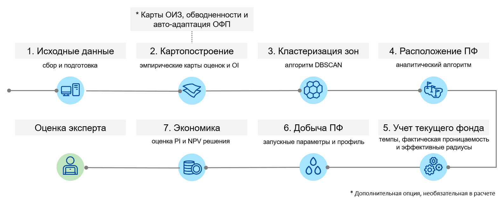
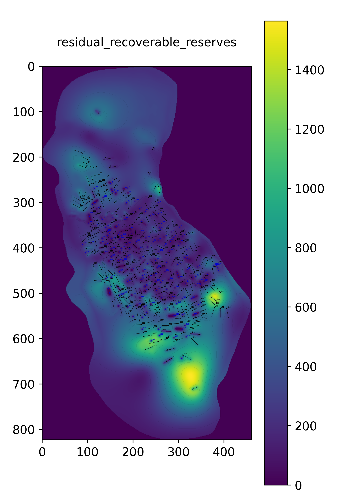
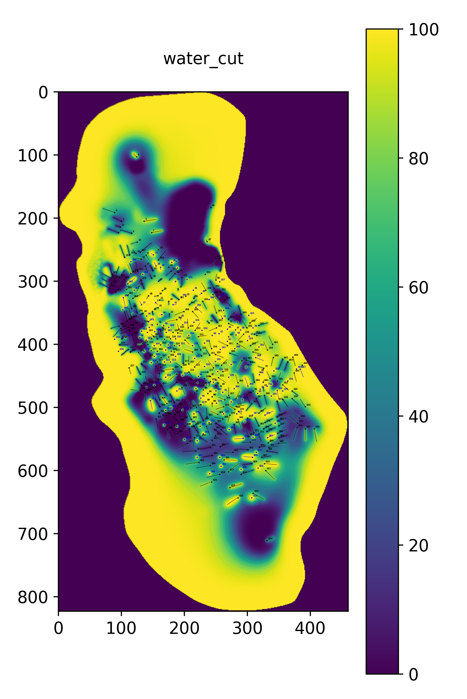

<h1 align="center">Infill Drilling</h1>
<h3 align="center">Авто-подбор зон и кандидатов для уплотняющего бурения (АВНС)</h3>

<p align="center">
  
  
  
  
</p>

**«АВНС»** — это Python-проект для автоматического поиска перспективных зон, расстановки проектных скважин и 
расчета рейтинга бурения на зрелых нефтяных месторождениях.

## 📚 Содержание
- [Описание проекта](#-описание-проекта)
- [Архитектура системы](#-архитектура-системы)
- [Входные данные](#-входные-данные)
- [Пример результатов](#-пример-результатов)
- [Зависимости и интеграции](#-зависимости-и-интеграции)
- [Философия системы](#-философия-системы)
- [Авторы](#-авторы)
- [Лицензия](#-лицензия)


## 🔍 Описание проекта
Уплотняющее бурение — одно из ключевых мероприятий для увелечения коэффициента охвата и 
коэффициента извлечения нефти (КИН) на поздних стадиях разработки месторождений.

**«АВНС»** выполняет:  
- автоматическое выделение перспективных зон для бурения;
- размещение проектного фонда в этих зонах;
- оценку потенциала проектных скважин (запускные параметры, темпы падения);
- расчёт экономической эффективности мероприятий.

Помощь инструмента заключается в экспресс скрининге, в валидации исходных данных и быстрых подсказках, 
на которые должен обратить внимание эксперт, а не в поиске "идеального" варианта.

📖 Более подробно методологические подходы и мировой опыт решения задач уплотняющего бурения 
описаны в [литературном обзоре нашей команды](https://proneft.elpub.ru/jour/article/download/536/532). Данный обзор стал отправной точкой при создании и проектировании системы «АВНС».

По итогам разработки системы «АВНС» планируется публикация научно-практической статьи, 
посвящённой методологии, ключевым алгоритмам, практическим кейсам и возникающим трудностям и ограничениям.

## 🧩 Архитектура системы
Система построена по модульному принципу, что обеспечивает гибкость, прозрачность и воспроизводимость результатов. 
Все этапы обработки данных и анализа выполняются последовательно, с возможностью контроля на каждом шаге.



### Ключевые этапы:
### 1. Преобработка исходных данных
* Загрузка, фильтрация и очистка от некорректных записей.
* Расчет дополнительных показателей (средние дебиты, давления, обводнённость и др.).
* Идентификация МЗС/ЗБС и перераспределение добычи.
> **Результат:** таблицы `data_history` (полная история) и `data_wells` (агрегированные параметры скважин).

### 2. Картопостроение
* Построение нормализованных карт:
  * **Оценка качества коллектора** — среднее ННТ и проницаемости. 
  * **Оценка потенциала** — комбинация дебитов и ОИЗ.
  * **Оценка рисков** — учет обводненности и снижения пластового давления. 
  * **Индекс возможностей бурения (OI)** = комбинация трех оценок.
* Дополнительные опции (при необходимости):
  * Построение **карт ОИЗ и обводнённости** — собственная библиотека [`reservoir-maps`](https://github.com/Alina-Murzakova/reservoir-maps).
  * Авто-адаптация **ОФП** (*history matching*) — через параметр `switch_adaptation_relative_permeability`.

> **Результат:** набор нормализованных карт для поиска перспективных зон и рассчитанные карты ОИЗ/обводнённости.

### 3. Кластеризация зон
Выделение **перспективных участков** для бурения:
* Исключение областей фактического фонда (эффективные радиусы).
* Отбор точек с высоким OI по перцентилю (`percent_top`). 
* Применение алгоритма **DBSCAN**:
  * `min_radius` — минимальный радиус зоны для бурения в точке;
  * `sensitivity_quality_drill` — чувствительность к качеству зоны.
* Формирование связанных зон для бурения.
> **Результат:** геопространственные кластеры — перспективные зоны для размещения проектного фонда. 

### 4. Размещение проектного фонда (ПФ)
Автоматическое размещение проектных скважин в выделенных зонах:
* Определение начального количества скважин (кластеров) по минимально рентабельным запасам (`init_profit_cum_oil`).
* Кластеризация **KMeans** для разбиения перспективной зоны на участки скважин.
* Итеративная оптимизация (для предотвращения пересечения стволов):
  * сдвиг; 
  * вращение;
  * сокращение длины ствола; 
  * удаление проектной скважины, если решение не найдено.
> Результат: координаты точек Т1 и Т3 проектных скважин. 

> 💡 **Для справки:**  
> Методология подробно реализована в репозитории [Init_project_wells](https://github.com/Alina-Murzakova/Init_project_wells),
> где можно посмотреть примеры кода и пошаговую реализацию алгоритма.

### 5. Учет текущего фонда
* Расчёт **эффективных радиусов**:
  * добывающие — по накопленной добыче и поровому объёму;
  * нагнетательные — по полезной закачке и коэффициентам участия.
* Нормализация радиусов на **ячейки Вороного**.
* Расчёт **фактической проницаемости** (обратный пересчёт через **рейтинг бурения РБ**).
* Аппроксимация **темпов падения** (двойной Арпс).
> **Результат:** параметры фактического фонда для учета в ПФ.

### 6. Добыча проектного фонда
* Расчёт **стартовых параметров** (методика РБ).
* Оценка **запасов** через ячейки Вороного и карту ОИЗ. 
* Формирование **профилей добычи**:
  * средние темпы с ближайшего окружения; 
  * контроль запасов и обводнённости.
> Результат: сформированный рейтинг бурения проектных скважин.

### 7. Экономическая оценка
Финансово-экономическая модель (ФЭМ) на заданный период (по умолчанию — 25 лет):
* Доходы, OPEX, CAPEX, налоги, амортизация.
* Ключевые показатели эффективности:
  * дисконтированные метрики (DCF, NPV, PI, IRR);
  * оценка EBITDA, EBIT, NOPAT, OCF, FCF, накопленного потока наличности.
> **Результат:** ФЭМ с показателями эффективности.

### 8. Экспертная оценка
* Эксперт анализирует выделенные зоны, расположение скважин, запускные параметры. 
* Корректировка параметров и пересчёт (при необходимости). 
> **Результат:** бизнес-кейс по бурению.

## 📥 Входные данные
На вход система принимает следующие категории данных:
* **Карты** (в формате .grd): 
  * Нефтенасыщенная толщина (NNT.grd)
  * Начальная нефтенасыщенность (initial_oil_saturation.grd)
  * Проницаемость (permeability.grd)
  * Пористость (porosity.grd)
  * Давление (pressure.grd)
  * ОИЗ (residual_recoverable_reserves.grd) – при наличии 
  * Обводненность (water_cut) – при наличии
* **Скважинные данные:**
  * История добычи, закачки (МЭР и ТР)
  * Координаты, характер работы, состояние
  * Забойные и пластовые давления (ТР)
* **Фрак-листы ГРП:**
  * Даты, параметры трещин (полудлина, ширина, стадии)
* **ГФХ-параметры по объектам:**
  * Вязкости, сжимаемости, давление насыщения, плотность и др.
* **Экономические параметры:**
  * CAPEX, OPEX, налоги, макропараметры и др.
* **Дополнительные параметры [`local_parameters.txt`](example_data/local_parameters.txt):**
  * Параметры расчета
  * Значения по умолчанию

Основные исходные данные могут быть сформированы из корпоративных систем (например, NGT-Smart, РН-КИН).  
[Пример исходных данных](example_data)

Все данные стандартизированы через файл конфигурации ([config.py](app/config.py)), что позволяет легко адаптировать проект под разные активы.

> **Примечание:**  
> В шаблонах представлены только структура и названия столбцов.  
> Фактические данные не публикуются из-за конфиденциальности.
> Шаблоны приведены для ознакомления с форматом.

## 🗺️ Пример результатов
| Индекс возможности <br> бурения                                             | ОИЗ                                                   | Обводненность                                                         |
|-----------------------------------------------------------------------------|-------------------------------------------------------|-----------------------------------------------------------------------|
|  |  |  |

| Индекс возможности <br> бурения c зонами                                     | ОИЗ с проектным фондом                                     | Начальное расположение <br> проектного фонда                                |
|------------------------------------------------------------------------------|------------------------------------------------------------|-----------------------------------------------------------------------------|
|  |  |  |

## 🔗 Зависимости и интеграции
* `reservoir_maps` — внешняя библиотека для расчёта карт обводнённости и ОИЗ:
```bash
pip install git+https://github.com/Alina-Murzakova/reservoir-maps.git
```

* Основные библиотеки: `numpy`, `pandas`, `geopandas`, `shapely`, `scikit-learn`, `matplotlib`
```bash
pip install -r requirements.txt
```

## 🧠 Философия системы
> "Не черный ящик, а аналитический помощник" 

* Прозрачные алгоритмы, понятные инженерам
* Минимум требований к данным — работает без ГДМ
* Гибкие параметры — настройка под любой актив
* Быстрый скрининг — от данных до бизнес-кейса за часы

## 🛠️ Планы разработки

- [ ] Вставка синтетического примера в README.md (для демонстрации работы без реальных данных)
- [ ] Создание минимального пользовательского интерфейса
- [ ] Подготовка научно-практической статьи по модулю «АВНС»
- [ ] Тестирование функционала
- [ ] Оптимизация расположения скважин с учётом экономических показателей

## 🧑‍💻 Авторы
* [Anastasia Rybakovskaya](https://github.com/ryba-kovskaya)
* [Alina Murzakova](https://github.com/Alina-Murzakova)

## 📄 Лицензия
Проект распространяется под лицензией [MIT](LICENSE).


